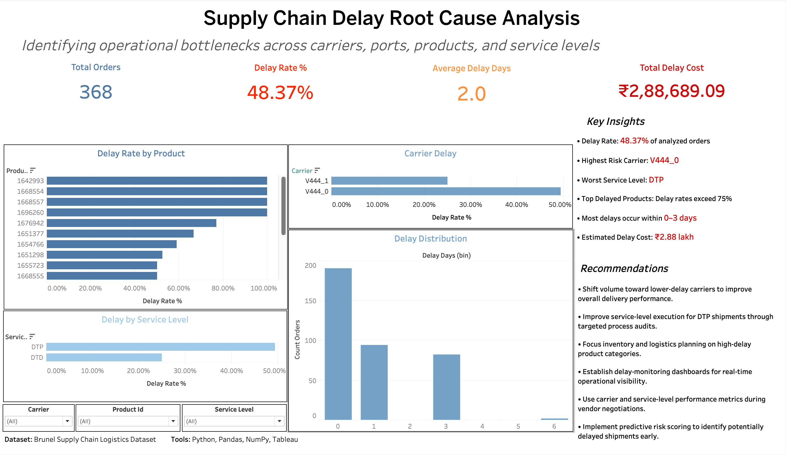

# Supply Chain Delay Root Cause Analysis Dashboard

## Overview

This project analyzes shipment delays in a supply chain logistics network using Python for data preprocessing and Tableau for interactive visualization.

The objective is to identify operational bottlenecks, evaluate carrier and service-level performance, quantify the business impact of delays, and provide actionable recommendations for improving logistics efficiency.

---

## Problem Statement

Supply chain delays can significantly impact customer satisfaction, operational efficiency, and overall logistics costs.

This project aims to answer the following business questions:

- What percentage of shipments are delayed?
- Which carriers contribute the most to delays?
- Which products experience the highest delay rates?
- How do service levels affect shipment performance?
- What is the financial impact of shipment delays?
- What operational improvements can reduce future delays?

---

## Dataset

**Dataset:** Brunel Supply Chain Logistics Dataset

The dataset contains shipment-level information including:

- Order Details
- Carrier Information
- Product Information
- Service Levels
- Origin Ports
- Freight Costs
- Delay Metrics
- Capacity Constraints

---

## Tools & Technologies

### Data Processing

- Python
- Pandas
- NumPy

### Visualization

- Tableau

### Development Environment

- Google Colab

---

## Data Cleaning & Feature Engineering

The following preprocessing steps were performed:

### Data Cleaning

- Removed duplicate records
- Handled missing values
- Standardized column names
- Converted date columns to datetime format
- Corrected inconsistent data types

### Feature Engineering

Created the following business metrics:

| Metric | Description |
|----------|------------|
| Delay Days | Number of days shipment was delayed |
| Is Delayed | Binary indicator for delayed shipments |
| Delay Rate | Percentage of delayed shipments |
| Delay Cost | Estimated business impact of delays |
| Ship Late Day Count | Total late shipment days |
| Ship Ahead Day Count | Total early shipment days |

---

## Dashboard KPIs

The dashboard tracks the following key metrics:

### Total Orders

Measures the total number of shipments analyzed.

### Delay Rate %

Percentage of orders experiencing delays.

### Average Delay Days

Average delay duration across delayed shipments.

### Total Delay Cost

Estimated financial impact caused by shipment delays.

---

## Dashboard Components

### Delay Rate by Product

Identifies products with the highest delay rates and highlights potential operational bottlenecks.

### Carrier Delay Analysis

Compares carrier performance based on shipment delay rates.

### Delay by Service Level

Evaluates how different service levels influence shipment delays.

### Delay Distribution

Shows the frequency distribution of shipment delay durations.

### Interactive Filters

- Carrier
- Product ID
- Service Level

All dashboard metrics update dynamically based on selected filters.

---

## Key Findings

- Nearly half of the analyzed shipments experienced delays.
- Carrier **V444_0** exhibited significantly higher delay rates than **V444_1**.
- Service Level **DTP** showed the highest delay incidence.
- Several products recorded delay rates exceeding **75%**.
- Most shipment delays were concentrated within **0–3 days**, indicating frequent short-term disruptions.
- Delay-related operational impact exceeded **₹2.88 lakh**.

---

## Business Recommendations

- Shift shipment volume toward lower-delay carriers.
- Conduct operational audits for high-risk service levels.
- Prioritize improvement initiatives for products with consistently high delay rates.
- Implement proactive monitoring for potentially delayed shipments.
- Strengthen carrier performance management using SLA-based KPIs.
- Establish predictive delay-risk monitoring to identify issues before shipment deadlines are missed.

---

## Dashboard Preview



---

## Project Workflow

```text
Raw Data
   ↓
Data Cleaning
   ↓
Feature Engineering
   ↓
Exploratory Data Analysis
   ↓
Business KPI Creation
   ↓
Tableau Dashboard Development
   ↓
Insights & Recommendations
```

---

## Future Improvements

- Build a predictive delay classification model using Machine Learning.
- Forecast delay risks based on carrier and service-level history.
- Integrate real-time shipment monitoring.
- Deploy the dashboard using Tableau Public or Power BI Service.

---

## Author

**Gauri Mehrotra**


Interested in:
- Data Analytics
- Business Intelligence
- Machine Learning


---

## Tableau Dashboard


https://public.tableau.com/app/profile/gauri.mehrotra/viz/SupplyChainDelayRootCauseAnalysis/Dashboard1?publish=yes


---

## License

This project is intended for educational and portfolio purposes.